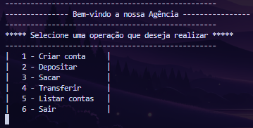

<h1 align="center"> 
    Agencia-Bancaria-AJS
</h1>
<p align="center">
  <a href="#-About">About</a>&nbsp;&nbsp;&nbsp;|&nbsp;&nbsp;&nbsp;
  <a href="#-Technologies">Technologies</a>&nbsp;&nbsp;&nbsp;|&nbsp;&nbsp;&nbsp;
  <a href="#-How to run">How to run</a>
</p>
<p align="center">
    
</p>

<h5 style="text-align: center"> Thank you for see !</h5>


## 📚 Sobre

Olá, ótimo 2025 a todos! Esse sistema tem como objetivo apresentar uma pequena simulação de agencia bancária, foi utilizado como fonte de estudo o _Youtube_
com o canal: _Zé codes_, além da documentação do `Java` e o site `W3School`.

Com esse sistema podemos realizar o cadastro de várias contas bancárias, depositar a quantidade de valor da sua escolha, com duas contas criadas podemos realizar transferência entre elas e caso tenha alguma dúvida temos um menu que é mostrado depois de cada ação como é o caso da listagem de conta, em toda ação é retornado uma mensagem correspondente a sendo ela positiva ou
negativa.

**Estrutura de Pasta:**

```
Agencia-Bancaria-AJS/
├── bin/
│   └── Programa/
│       ├── AgenciaBancaria.class
│       ├── Conta.class
│       ├── Pessoa.class
│       └── utilitarios/
│           └── Utils.class
│
├── src/
│   ├── Programa/
│   │   ├── AgenciaBancaria.java
│   │   ├── Conta.java
│   │   └── Pessoa.java
│   │
│   └── utilitarios/
│       └── Utils.java
```

_Embora não tenhamos a parte visual em um navegador apenas no terminal trabalhamos bem a parte lógica, mesmo com pouco conhecimento aplicamos e buscamos entender como é utilizado `Package`, `Modificadores de Acesso`, entendendo como usar e aproveitar `Classes, Objetos, Construtores e Funções`, utilizando `Setters e Getters em um Método` no `Java`_.


Para ter acesso a conteúdo similares, acesse: [Zé codes](https://www.youtube.com/@zecodes6628)

## 🧪 Tecnologias

Esse projeto foi desenvolvido com as seguintes tecnologias:

- [Java](https://docs.oracle.com/en/java/index.html)
## 🚀 Como executar

Clone o projeto e acesse a pasta.

```bash
$ git clone https://github.com/arthursj/Agencia-Bancaria-AJS.git
$ cd Agencia-Bancaria-AJS
```

Para iniciá-lo, siga o passo abaixo:
```bash
# compilação
$ javac src/Programa/*.java
# execução
$ java -cp src Programa.AgenciaBancaria
```

## 📚 About

Hello, great 2025 to everyone! This system aims to present a small simulation of a bank branch. The study source used was YouTube, specifically the channel _Zé Codes_, as well as `Java` documentation and the `W3School` website.

With this system, we can register multiple bank accounts, deposit the amount of money of our choice, and with two accounts created, we can transfer money between them. If you have any questions, a menu is displayed after each action, such as listing accounts, for every action, a corresponding message is returned, either positive or negative.

**Folder Structure:**

```
Agencia-Bancaria-AJS/
├── bin/
│   └── Programa/
│       ├── AgenciaBancaria.class
│       ├── Conta.class
│       ├── Pessoa.class
│       └── utilitarios/
│           └── Utils.class
│
├── src/
│   ├── Programa/
│   │   ├── AgenciaBancaria.java
│   │   ├── Conta.java
│   │   └── Pessoa.java
│   │
│   └── utilitarios/
│       └── Utils.java
```


_Although we don't have the visual part in a browser, only in the terminal, we worked well on the logical part. Even with limited knowledge, we applied and sought to understand how to use `Packages`, `Access Modifiers`, and how to use and take advantage of `Classes, Objects, Constructors, and Functions`, using `Setters and Getters in a Method` in `Java`_.

To access similar content, visit: [Zé codes](https://www.youtube.com/@zecodes6628)

## 🧪 Technologies

This project was developed with the following technologies:

- [Java](https://docs.oracle.com/en/java/index.html)

## 🚀 How to run

Clone the project and access the folder and install the dependencies.

```bash
$ git clone https://github.com/arthursj/Agencia-Bancaria-AJS.git
$ cd Agencia-Bancaria-AJS
```

To start it, follow the step below:
```bash
# compilation
$ javac src/Programa/*.java
# execution
$ java -cp src Programa.AgenciaBancaria
```
--------------

Developed by :atom_symbol: [**Arthur Silva**]([arthursj (ArthurSilva) (github.com)](https://github.com/arthursj))
